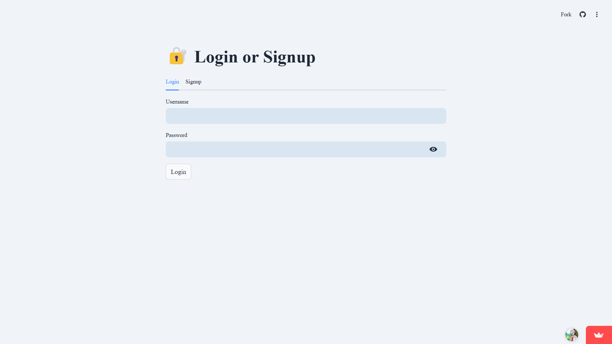
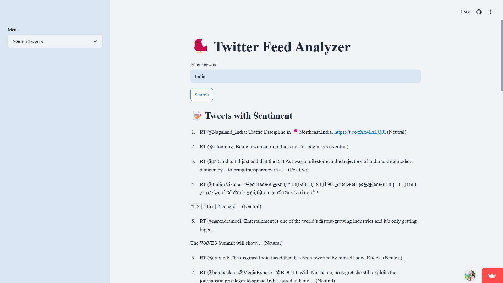
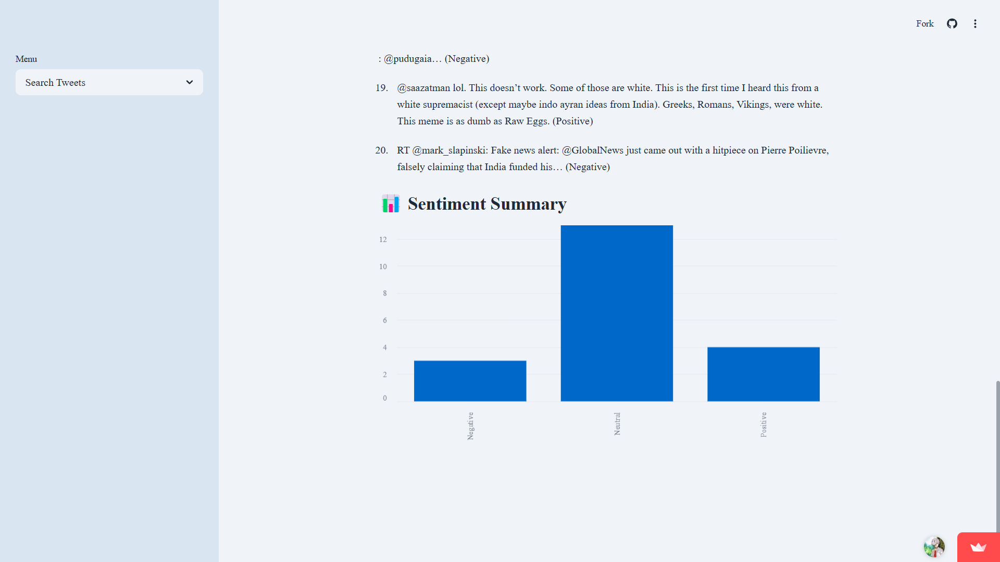
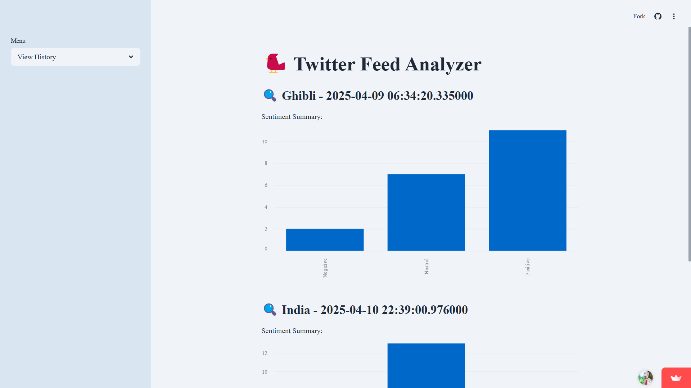
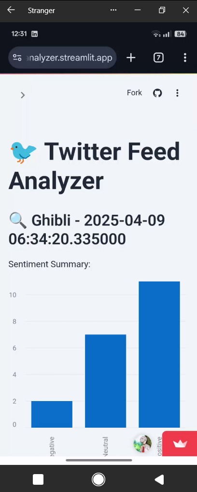

# 🐦 Twitter Feed Analyzer

**Twitter Feed Analyzer** is a full-stack Python web application that allows users to search for recent tweets based on keywords, perform sentiment analysis, and visualize the results—all in a secure, user-friendly interface powered by **Streamlit** and **MongoDB**.

---

## 🚀 Features

- 🔐 **User Authentication**

  - Signup and login functionality with password hashing using `bcrypt`.

- 🔍 **Search Tweets**

  - Fetches real-time tweets using the Twitter API v2.

- 🧠 **Sentiment Analysis**

  - Analyzes tweets using `TextBlob` and classifies them as _Positive_, _Neutral_, or _Negative_.

- 💾 **MongoDB Integration**

  - Stores user profiles, tweets, and search history using MongoDB.

- 📈 **Search History**

  - Displays previously searched keywords with timestamped results and sentiment summaries.

- 📊 **Data Visualization**

  - Visualizes sentiment breakdowns with charts for better insight.

---

## 🧱 Project Structure

```bash
devsuryansh-twitterfeedanalyzer/
├── README.md                # Project documentation
├── app.py                  # Main Streamlit application
├── requirements.txt        # Required Python packages
├── analysis/
│   └── sentiment.py        # Sentiment analysis logic using TextBlob
├── auth/
│   └── auth_manager.py     # User login/signup handlers
├── config/
│   └── config.py           # API keys and MongoDB config (via dotenv)
├── db/
│   └── mongo.py            # MongoDB database logic
├── docs/                   # Documentation assets
├── icon/
│   └── icon.py             # Custom icon loader for Streamlit tab
├── twitter/
│   └── fetch.py            # Twitter API v2 integration
├── utils/
│   └── helpers.py          # Common utility functions
└── .streamlit/
    └── config.toml         # Custom Streamlit theming
```

## 🛠️ Setup Instructions

### 1. Clone the Repository

```bash
git clone https://github.com/devSuryansh/TwitterFeedAnalyzer.git
cd TwitterFeedAnalyzer
```

### 2. Create Virtual Environment

```bash
python -m venv env
source env/bin/activate        # macOS/Linux
env\Scripts\activate           # Windows
```

### 3. Install Dependencies

```bash
pip install -r requirements.txt
```

### 4. Configure Environment Variables

Create a `.env` file in the root directory:

```ini
# .env
MONGO_URI=your_mongodb_connection_string
TWITTER_BEARER_TOKEN=your_twitter_bearer_token
```

### 5. Run the Application

```bash
streamlit run app.py
```

---

## 📸 App Screenshots

| Login / Signup                  | Search Tweets                     | Sentiment Summary                   |
| ------------------------------- | --------------------------------- | ----------------------------------- |
|  |  |  |

| View History                        | Mobile View                            |
| ----------------------------------- | -------------------------------------- |
|  |  |

---

## 📊 How Sentiment Analysis Works

- The app uses **TextBlob** to analyze the polarity of each tweet:
  - `> 0` → Positive
  - `= 0` → Neutral
  - `< 0` → Negative

This is visualized as a bar chart in Streamlit using real-time tweet data.

---

## 💡 Example Use Case

1. A user signs up and logs in.
2. Enters a keyword like `AI` or `climate change`.
3. Tweets are fetched via Twitter API.
4. Each tweet undergoes sentiment analysis.
5. Results are saved to MongoDB.
6. Sentiment summary is displayed visually.

---

## 🔐 Security

- Passwords are securely hashed using `bcrypt`.
- Twitter and MongoDB credentials are managed through environment variables.
- No sensitive data is exposed in the codebase.

---

## 📦 Dependencies

Core packages in `requirements.txt` include:

- `streamlit`, `textblob`, `pymongo`, `bcrypt`, `requests`, `pandas`, `dotenv`, `matplotlib`

> To install all, run:
>
> `pip install -r requirements.txt`

---

## 📌 To-Do / Future Enhancements

- 📤 Export sentiment reports (PDF/CSV)
- 🔍 Multi-keyword comparison
- 🧠 Use advanced transformer-based sentiment models (like BERT)
- 🌐 Responsive mobile UI

---

## 🤝 Contributing

Contributions are welcome! Please open an issue or submit a pull request.

---

## 👤 Author

**Suryansh Singh**

[GitHub](https://github.com/devSuryansh) | [LinkedIn](https://linkedin.com/in/suryansh--singh)
